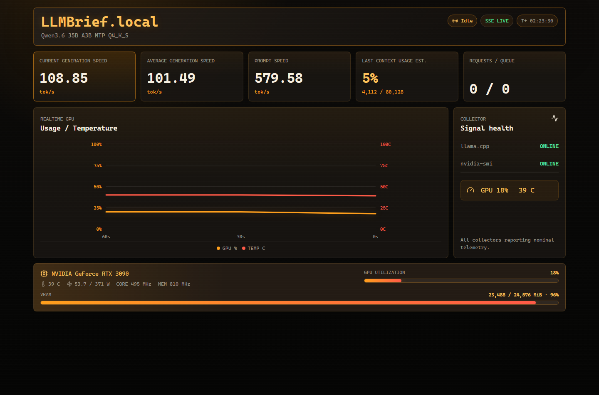

# LLMBrief.local

Local-only telemetry dashboard for a `llama.cpp` server and NVIDIA GPU stats.



## Features

- **Live GPU Chart** — real-time usage and temperature, persists across page refresh
- **Speed Tracking** — current, average generation speed and prompt processing speed
- **Context Usage** — estimated model memory (KV cache) occupancy
- **Request Status** — active and queued generation requests
- **GPU Details** — VRAM, power draw, clock speeds, and temperature
- **Always On** — dashboard stays up even if llama.cpp or GPU is temporarily unavailable

## Requirements

- **Windows** (PowerShell 5.1+)
- **Node.js** 20+
- **Python** 3.11+
- **NVIDIA driver** with `nvidia-smi` available on `PATH`
- **llama.cpp server** running with `--metrics` flag

### Start llama.cpp with metrics

```powershell
.\llama-server.exe --host 127.0.0.1 --port 6688 --metrics ...
```

The `--metrics` flag is required. The dashboard reads from `http://localhost:6688/metrics` and `/slots` by default.

## Quick Start

From PowerShell, run:

```powershell
.\scripts\run-local.ps1
```

Then open:

```
http://127.0.0.1:5173
```

The script handles everything:
1. Installs Node.js dependencies (`npm install`)
2. Installs Python dependencies (`pip install -r requirements.txt`)
3. Starts the backend (FastAPI + Uvicorn) and frontend (Vite) in parallel

## Manual Setup

If you prefer to run things manually:

```powershell
# 1. Install dependencies
pip install -r requirements.txt
npm install

# 2. Start both servers
npm run dev
```

This runs the backend (`python -m backend.run`) and frontend (`vite`) in parallel. Open `http://127.0.0.1:5173`.

### Separate terminals

```powershell
# Terminal 1 — Backend
python -m backend.run

# Terminal 2 — Frontend
npm run dev:frontend
```

## Configuration

### PowerShell script parameters

```powershell
.\scripts\run-local.ps1 `
  -BackendPort 7171 `
  -FrontendPort 5173 `
  -LlamaMetricsUrl "http://localhost:6688/metrics" `
  -ModelName "MyCustomModel"
```

### Environment variables

| Variable | Default | Description |
| --- | --- | --- |
| `BACKEND_PORT` | `7171` | Backend server port |
| `FRONTEND_PORT` | `5173` | Vite dev server port |
| `LLAMA_METRICS_URL` | `http://localhost:6688/metrics` | llama.cpp metrics endpoint |
| `POLL_INTERVAL_SECONDS` | `0.1` | llama.cpp poll frequency |
| `GPU_POLL_INTERVAL_SECONDS` | `1` | nvidia-smi poll frequency |
| `MODEL_NAME` | *(auto-detected)* | Override model display name |

## API

| Endpoint | Method | Description |
| --- | --- | --- |
| `/api/status` | `GET` | Current telemetry snapshot (JSON) |
| `/api/events` | `GET` | SSE stream of telemetry snapshots |

### Response format

```json
{
  "updatedAt": 1710000000.0,
  "status": "Generating",
  "llama": {
    "ok": true,
    "model": "my-model.gguf",
    "currentGenerationSpeed": 45.2,
    "averageGenerationSpeed": 42.8,
    "totalGenerationTokens": 1234,
    "promptSpeed": 120.0,
    "contextUsed": 4096,
    "contextTotal": 8192,
    "requestsProcessing": 1,
    "requestsQueued": 0
  },
  "gpu": {
    "ok": true,
    "name": "NVIDIA GeForce RTX 4090",
    "utilization": 85,
    "vramUsed": 18432,
    "vramTotal": 24576,
    "temperature": 72,
    "powerDraw": 320.5,
    "powerLimit": 450,
    "coreClock": 2520,
    "memoryClock": 3840,
    "pstate": "P2"
  },
  "chartSamples": [
    { "time": 1710000000.0, "utilization": 85, "temperature": 72 }
  ],
  "speedSamples": [45.2, 44.8, 46.1],
  "config": {
    "backendPort": 7171,
    "llamaMetricsUrl": "http://localhost:6688/metrics",
    "pollIntervalSeconds": 0.1,
    "gpuPollIntervalSeconds": 1
  }
}
```

## Architecture

```
┌────────────────────┐
│ llama.cpp server   │
│ Port: 6688         │
│                    │
│ Endpoints:         │
│  - /metrics        │
│  - /slots          │
└─────────┬──────────┘
          │
          │ HTTP polling
          ▼
┌────────────────────┐
│ Backend (FastAPI)  │
│ Port: 7171         │
│                    │
│ poll_loop()        │
│ /api/status        │
│ /api/events        │
└──────┬────────┬────┘
       │        │
       │        │ SSE
       │        ▼
       │   ┌────────────────────┐
       │   │ Frontend (React)   │
       │   │ Port: 5173         │
       │   │                    │
       │   │ Live chart         │
       │   │ Metrics UI         │
       │   └────────────────────┘
       │
       │ subprocess
       ▼
┌────────────────────┐
│ nvidia-smi         │
└────────────────────┘
```

- **Backend** polls `llama.cpp` (`/metrics`, `/slots`) every 100ms and `nvidia-smi` every 1s, buffers chart and speed samples in memory, and streams snapshots via SSE
- **Frontend** subscribes to SSE, renders live chart and metrics, with automatic fallback to polling if SSE drops

## Notes

- `Last context usage est.` is an estimate derived from prompt token deltas plus decoded slot tokens. `llama.cpp` exposes slot capacity through `/slots.n_ctx` but does not directly expose current KV cache occupancy in `/metrics`.
- Chart and speed samples are stored in backend memory and survive page refreshes, but are lost if the backend process restarts.
